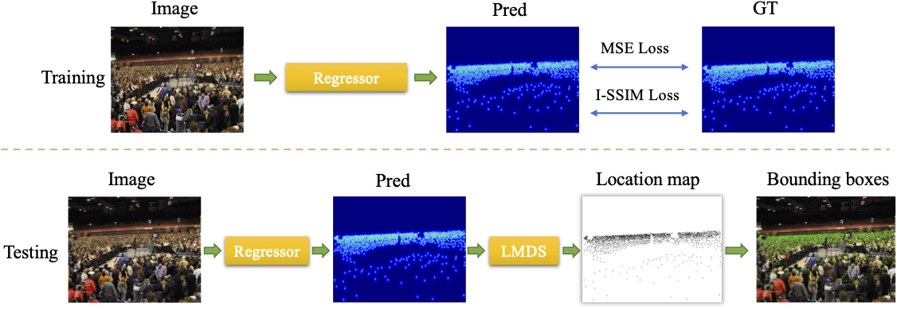
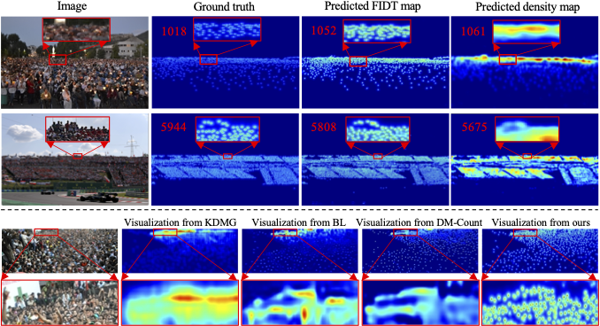
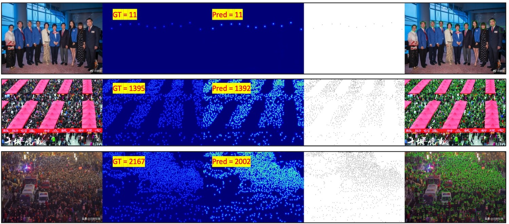
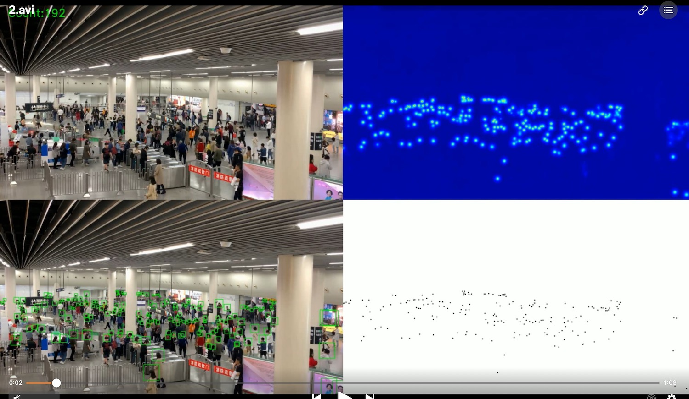

# Focal Inverse Distance Transform Map
* An officical implementation of Focal Inverse Distance Transform Map. We propose a novel map named Focal Inverse Distance Transform (FIDT) map,  which can represent each head location information.

* Paper [Link](https://arxiv.org/abs/2102.07925)

## News
We now provide the predicted coordinates txt files, and other researchers can use them to fairly evaluate the localization performance.
## Overview


# Visualizations
Compared with density map


Visualizations for bounding boxes


# Progress
- [x] Testing Code (2021.3.16)
- [x] Training baseline code (2021.4.29)
- [x] Pretrained model
  - [x] ShanghaiA  (2021.3.16)
  - [x] ShanghaiB  (2021.3.16)
  - [x] UCF_QNRF (2021.4.29)
  - [x] JHU-Crowd++ (2021.4.29)
  - [x] NWPU-Crowd++ (2021.4.29)
- [x] Bounding boxes visualizations(2021.3.24)
- [x] Video demo(2021.3.29)
- [x] Predicted coordinates txt file(2021.8.20)
# Environment

	python >=3.6 
	pytorch >=1.4
	opencv-python >=4.0
	scipy >=1.4.0
	h5py >=2.10
	pillow >=7.0.0
	imageio >=1.18
	nni >=2.0 (python3 -m pip install --upgrade nni)

# Datasets

- Download ShanghaiTech dataset from [Baidu-Disk](https://pan.baidu.com/s/15WJ-Mm_B_2lY90uBZbsLwA), passward:cjnx; or [Google-Drive](https://drive.google.com/file/d/1CkYppr_IqR1s6wi53l2gKoGqm7LkJ-Lc/view?usp=sharing)
- Download UCF-QNRF dataset from [here](https://www.crcv.ucf.edu/data/ucf-qnrf/)
- Download JHU-CROWD ++ dataset from [here](http://www.crowd-counting.com/)
- Download NWPU-CROWD dataset from [Baidu-Disk](https://pan.baidu.com/s/1VhFlS5row-ATReskMn5xTw), passward:3awa; or [Google-Drive](https://drive.google.com/file/d/1drjYZW7hp6bQI39u7ffPYwt4Kno9cLu8/view?usp=sharing)

# Generate FIDT Ground-Truth

```
cd data
run  python fidt_generate_xx.py
```

“xx” means the dataset name, including sh, jhu, qnrf, and nwpu. You should change the dataset path.

# Model

Download the pretrained model from [Baidu-Disk](https://pan.baidu.com/s/1SaPppYrkqdWeHueNlcvUJw), passward:gqqm, or [OneDrive](https://1drv.ms/u/s!Ak_WZsh5Fl0lhCneubkIv1mTllAZ?e=0zMHSM)

# Quickly test

```
git clone https://github.com/dk-liang/FIDTM.git
```
Download Dataset and Model  
Generate FIDT map ground-truth  

```
Generate image file list: python make_npydata.py
```

**Test example:**

```
python test.py --dataset ShanghaiA --pre ./model/ShanghaiA/model_best.pth --gpu_id 0
python test.py --dataset ShanghaiB --pre ./model/ShanghaiB/model_best.pth --gpu_id 1  
python test.py --dataset UCF_QNRF --pre ./model/UCF_QNRF/model_best.pth --gpu_id 2  
python test.py --dataset JHU --pre ./model/JHU/model_best.pth --gpu_id 3  
```
**If you want to generate bounding boxes,**

```
python test.py --test_dataset ShanghaiA --pre model_best.pth  --visual True
(remember to change the dataset path in test.py)  
```
**If you want to test a video,**

```
python video_demo.py --pre model_best.pth  --video_path demo.mp4
(the output video will in ./demo.avi; By default, the video size is reduced by two times for inference. You can change the input size in the video_demo.py)
```

Visiting [bilibili](https://www.bilibili.com/video/BV17v41187fs?from=search&seid=12553003238808495181) or [Youtube](https://youtu.be/YdH6YpHywM4) to watch the video demonstration. 

More config information is provided in config.py
# Evaluation localization performance
| Shanghai Teach Part A | Precision | Recall | F1-measure |
| :-------------------- | :-------- | :----- | ---------- |
| σ=4                   | 59.1%     | 58.2%  | 58.6%      |
| σ=8                   | 78.1%     | 77.0%  | 77.6%      |

| Shanghai Teach Part B | Precision | Recall | F1-measure |
| :-------------------- | :-------- | :----- | ---------- |
| σ=4                   | 64.9%     | 64.5%  | 64.7%      |
| σ=8                   | 83.9%     | 83.2%  | 83.5%      |

| JHU_Crowd++ <br />(test set) | Precision | Recall | F1-measure |
| :-------------------: | :-------: | :----: | :--------: |
| σ=4                   | 38.9% | 38.7% | 38.8% |
| σ=8                   | 62.5% | 62.4% | 62.4% |

| UCF_QNRF | Av.Precision | Av.Recall | Av. F1-measure |
| :-------------------- | :-------- | :----- | ---------- |
| σ=1....100                   | 84.49% | 80.10% | 82.23% |

| NWPU-Crowd (val set) | Precision | Recall | F1-measure |
| :-------------------- | :-------- | :----- | ---------- |
| σ=σ_l               | 82.2% | 75.9% | 78.9% |
| σ=σ_s | 76.7% | 70.9% | 73.7% |


**Evaluation example:**  

For Shanghai tech,  JHU-Crowd (test set), and NWPU-Crowd (val set):

```
cd ./local_eval
python eval.py ShanghaiA  
python eval.py ShanghaiB
python eval.py JHU  
python eval.py NWPU
```
For UCF-QNRF dataset:
```
python eval_qnrf.py --data_path path/to/UCF-QNRF_ECCV18 
```
For NWPU-Crowd (test set), please submit the nwpu_pred_fidt.txt to the [website](https://www.crowdbenchmark.com/nwpucrowdloc.html).

We also provide the predicted coordinates txt file in './local_eval/point_files/', and you can use them to fairly evaluate the other localization metric.   

 (We hope the community can provide the predicted coordinates file to help other researchers fairly evaluate the localization performance.)

**Tips**:
The GT format is:

```
1 x1 y1 4 8 x2 y2 4 8 ..... 
2 x1 y1 4 8 x2 y2 4 8 .....
```
The predicted format is:
```
1 x1 y1 x2 y2.....
2 x1 y1 x2 y2.....
```
The evaluation code is modifed from [NWPU](https://github.com/gjy3035/NWPU-Crowd-Sample-Code-for-Localization).


# Training

The training strategy is very simple. You can replace the density map with the FIDT map in any regressors for training. 

If you want to train based on the HRNET, please first download the ImageNet pre-trained models from the official [link](https://onedrive.live.com/?authkey=!AKvqI6pBZlifgJk&cid=F7FD0B7F26543CEB&id=F7FD0B7F26543CEB!116&parId=F7FD0B7F26543CEB!105&action=locate), and replace the pre-trained model path in HRNET/congfig.py (__C.PRE_HR_WEIGHTS). 

Here, we provide the training baseline code, and the I-SSIM loss will be released when the review is completed. 

**Training baseline example:**

```
python train_baseline.py --dataset ShanghaiA --crop_size 256 --save_path ./save_file/ShanghaiA 
python train_baseline.py --dataset ShanghaiB --crop_size 256 --save_path ./save_file/ShanghaiB  
python train_baseline.py --dataset UCF_QNRF --crop_size 512 --save_path ./save_file/QNRF
python train_baseline.py --dataset JHU --crop_size 512 --save_path ./save_file/JHU
```
For ShanghaiTech, you can train by a GPU with 8G memory. For other datasets, please utilize a single GPU with 24G memory or multiple GPU for training. We have reorganized the code, which is usually better than the results of the original [manuscript](https://arxiv.org/abs/2102.07925).

**Improvements**
We have not studied the effect of some super-parameters. Thus, the results can be further improved by some tricks, such as adjust the learning rate, batch size, crop size, and data augmentation. 

# Reference
If you find this project is useful for your research, please cite:
```
@article{liang2021focal,
  title={Focal Inverse Distance Transform Maps for Crowd Localization and Counting in Dense Crowd},
  author={Liang, Dingkang and Xu, Wei and Zhu, Yingying and Zhou, Yu},
  journal={arXiv preprint arXiv:2102.07925},
  year={2021}
}
```


